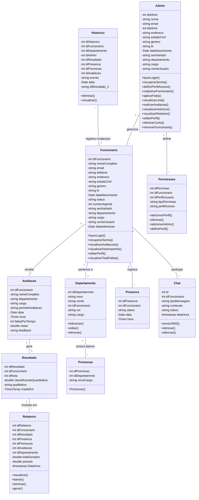
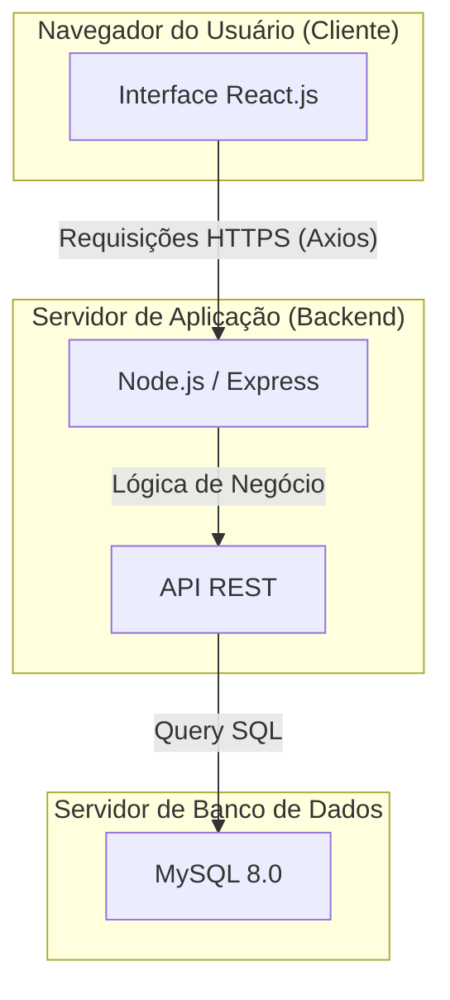
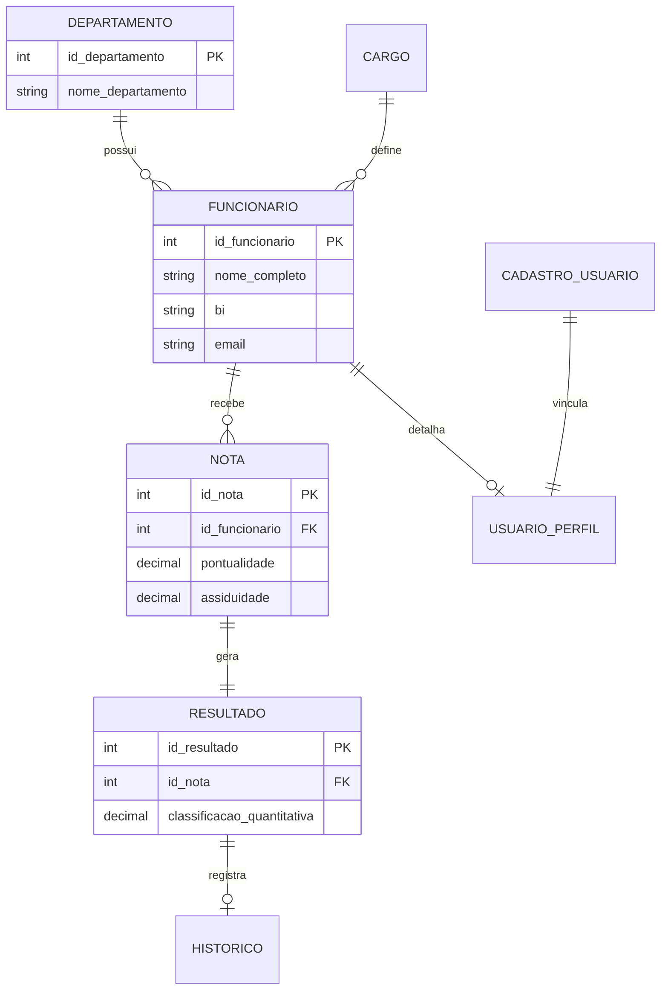

# Análise do Sistema: IPM360 - Gestão de Desempenho

Este documento apresenta uma análise técnica e funcional do sistema **IPM360**, projetado para automatizar e otimizar o processo de avaliação de desempenho de funcionários, garantindo integridade, transparência e agilidade nos dados.

## 1. Visão Geral do Sistema
O IPM360 é uma solução digital voltada para a gestão de recursos humanos, focada na avaliação multidimensional. O sistema permite que administradores realizem avaliações baseadas em critérios comportamentais e técnicos, enquanto fornece aos funcionários um portal para visualização de resultados e submissão de feedbacks.

## 2. Arquitetura Técnica
A arquitetura do sistema segue o modelo cliente-servidor, priorizando a escalabilidade e a experiência do usuário.

### 2.1 Frontend (Interface do Cliente)
Desenvolvido com **React.js** e estruturado através do **Vite**, o frontend utiliza **Tailwind CSS** para uma interface responsiva e moderna. A comunicação com o servidor é realizada via **Axios**, garantindo chamadas assíncronas eficientes.

### 2.2 Backend (Servidor de Lógica)
Construído em **Node.js** com o framework **Express**, o backend gerencia a lógica de negócios, cálculos de performance (médias ponderadas por grupos) e o sistema de notificações em tempo real.

### 2.3 Banco de Dados
Utiliza **MySQL** para persistência de dados. A estrutura inclui tabelas para funcionários, departamentos, cargos, notas, resultados e logs de histórico, garantindo a rastreabilidade total das operações.

---

## 3. Análise dos Requisitos Baseada nos Resultados da Investigação
A partir do inquérito aplicado aos 9 funcionários (conforme detalhado no Capítulo II), identificaram-se lacunas críticas que nortearam os requisitos do novo sistema.

### 3.1 Segurança e Confidencialidade
> **Contexto:** Dado que 90% dos funcionários não assinaram termos de confidencialidade e 67% consideram o processo atual inseguro.

**Implementação no IPM360:**
*   **RBAC (Role-Based Access Control):** O sistema implementa níveis de acesso distintos (Admin, Global Admin, Funcionário). Administradores possuem permissões para lançar notas e gerenciar perfis, enquanto funcionários acessam apenas seus próprios dados.
*   **Criptografia:** Senhas são armazenadas utilizando o algoritmo de hash `bcryptjs`, protegendo as credenciais de acesso contra vazamentos.

### 3.2 Acesso ao Histórico
> **Contexto:** Com 84% dos utilizadores relatando dificuldade em aceder a avaliações passadas.

**Implementação no IPM360:**
*   **Histórico do Funcionário:** O sistema centraliza todas as avaliações na tabela `historico`. Através da funcionalidade "Minhas Avaliações", o funcionário tem acesso imediato a todo o seu percurso avaliativo, com visualização detalhada de critérios e feedbacks passados.

### 3.3 Eficiência Temporal
> **Contexto:** O tempo de espera superior a um mês para aceder aos dados (relatado por 88% dos inquiridos).

**Implementação no IPM360:**
*   **Automatização do Fluxo:** O cálculo das médias de performance é automatizado no servidor (dividido em grupos Comportamental, Técnico-Pedagógico e Profissional).
*   **Visualização Imediata:** Assim que uma avaliação é submetida, o sistema gera notificações automáticas para o funcionário, permitindo a consulta instantânea do resultado quantitativo e qualitativo.

---

## 4. Levantamento de Requisitos do Sistema

Para garantir a eficácia do IPM360, o sistema foi estruturado sobre um conjunto robusto de requisitos funcionais e não funcionais, que traduzem as necessidades operacionais e as restrições técnicas do projeto.

### 4.1 Requisitos Funcionais (RF)
Os requisitos funcionais definem as ações que o sistema deve ser capaz de realizar. No IPM360, eles estão divididos nos seguintes eixos:

*   **RF01 - Controle de Acesso Baseado em Perfis (RBAC):** O sistema deve permitir a autenticação de usuários com papéis distintos (Administrador Global, Administrador de Departamento e Funcionário), restringindo as funcionalidades de acordo com o nível de autoridade.
*   **RF02 - Gestão Integral de Funcionários (CRUD):** Capacidade de cadastrar, editar, listar e remover funcionários, integrando dados pessoais, profissionais (BI, Cargo, Departamento) e credenciais de acesso de forma sincronizada.
*   **RF03 - Lançamento Multi-Critério de Avaliações:** O sistema deve permitir o registro de avaliações baseadas em três grandes grupos: Comportamental (pontualidade, assiduidade), Técnico-Pedagógico (para docentes) e Profissional (ética, iniciativa).
*   **RF04 - Cálculo Automatizado de Desempenho:** O backend deve calcular automaticamente a média ponderada das avaliações em uma escala de 0 a 20, derivando um resultado qualitativo (Mau, Razoável, Bom, Muito Bom) instantaneamente.
*   **RF05 - Módulo de Feedback Interativo:** Possibilitar o diálogo entre avaliador e avaliado. Funcionários podem expressar insatisfação, e administradores podem responder, mantendo um log completo de mensagens vinculadas a cada avaliação.
*   **RF06 - Central de Notificações em Tempo Real:** Disparo de alertas automáticos para usuários e administradores sobre novos resultados de avaliação, respostas de feedback ou alterações críticas no sistema.
*   **RF07 - Consulta de Histórico Consolidado:** O funcionário deve ter um portal dedicado para consultar todas as suas avaliações passadas e presentes, garantindo o "Acesso ao Histórico" identificado como falha no sistema anterior.
*   **RF08 - Gestão Hierárquica de Departamentos:** Permite organizar a estrutura da empresa em Departamentos e Seções/Cargos, facilitando a filtragem e a gestão setorial da performance.
*   **RF09 - Dashboards Administrativos:** Visualização gráfica e estatística do desempenho global da instituição, médias por departamento e contagem de ausências (faltas).
*   **RF10 - Auditoria Automática de Dados:** Registro (logs) no banco de dados de todas as inserções, atualizações e deleções de funcionários via triggers, garantindo a rastreabilidade das ações.

### 4.2 Requisitos Não Funcionais (RNF)
Os requisitos não funcionais definem as qualidades do sistema, focando no "como" ele deve operar em termos de segurança, performance e confiabilidade.

*   **RNF01 - Segurança da Informação:** Todas as senhas devem ser protegidas por hash (ex: `bcryptjs`) antes do armazenamento. A comunicação entre frontend e backend deve ser protegida para evitar acessos não autorizados.
*   **RNF02 - Performance e Tempo de Resposta:** O sistema deve utilizar uma arquitetura SPA (Single-Page Application) com **Vite** e **React** para garantir que a navegação entre dashboards e formulários ocorra sem recarregamento de página, reduzindo a latência percebida.
*   **RNF03 - Integridade e Consistência (Transações):** Operações críticas, como a submissão de uma avaliação que afeta múltiplas tabelas (nota, resultado, histórico, notificações), devem ser executadas dentro de transações de banco de dados para evitar inconsistências em caso de falha.
*   **RNF04 - Responsabilidade e UX:** A interface deve ser desenvolvida com **Tailwind CSS**, garantindo que o sistema seja utilizável em diferentes tamanhos de tela (Desktops e Tablets) e possua um design intuitivo e premium.
*   **RNF05 - Escalabilidade Modular:** O código deve ser organizado em controladores, rotas e serviços independentes, permitindo a expansão futura (ex: inclusão de novos modelos de avaliação) sem comprometer o sistema existente.
*   **RNF06 - Disponibilidade e Resiliência:** O backend deve ser capaz de lidar com requisições assíncronas massivas e fornecer feedbacks claros ao usuário em caso de erros de rede ou servidor.

---

## 5. Modelagem do Sistema (UML)

Para visualizar as interações e a estrutura de dados do IPM360, apresentam-se abaixo os diagramas de Casos de Uso e de Classes.

### 5.1 Diagrama de Casos de Uso
Este diagrama ilustra as principais funcionalidades disponíveis para os dois atores do sistema: o Administrador e o Funcionário.


```mermaid
useCaseDiagram
    actor "Administrador (RH/Gestor)" as Admin
    actor "Funcionário (Colaborador)" as Func

    package "Sistema IPM360" {
        usecase "Autenticar no Sistema" as UC1
        usecase "Gerenciar Funcionários (CRUD)" as UC2
        usecase "Lançar Avaliação de Desempenho" as UC3
        usecase "Visualizar Histórico Próprio" as UC4
        usecase "Enviar Feedback sobre Avaliação" as UC5
        usecase "Responder Diálogo de Feedback" as UC6
        usecase "Consultar Dashboards e Relatórios" as UC7
    }

    Admin --> UC1
    Admin --> UC2
    Admin --> UC3
    Admin --> UC6
    Admin --> UC7

    Func --> UC1
    Func --> UC4
    Func --> UC5
    Func --> UC6
```

#### **Elementos do Diagrama de Casos de Uso:**
*   **Atores (Actors):** Representados pelas figuras de "boneco", são as entidades externas que interagem com o sistema (Administrador e Funcionário).
*   **Casos de Uso (Use Cases):** Representados pelas elipses dentro da "Fronteira do Sistema", descrevem as funcionalidades ou serviços específicos que o IPM360 oferece.
*   **Associações:** As linhas que conectam os Atores aos Casos de Uso indicam que aquele ator participa ou inicia aquela ação específica.
*   **Fronteira do Sistema:** O retângulo que envolve os Casos de Uso delimita o escopo do software, separando o que é interno ao IPM360 do que é externo (atores).

### 5.2 Diagrama de Classes (Entidade-Relacionamento)
O diagrama abaixo representa a estrutura lógica das entidades no banco de dados e como elas se relacionam para sustentar as operações do sistema.




#### **Elementos do Diagrama de Classes:**
*   **Classes:** Representam as entidades principais do sistema (ex: `Funcionario`, `Nota`). Elas são os "moldes" para os objetos de dados que o sistema manipula.
*   **Atributos:** Localizados na parte superior da caixa da classe, representam as propriedades (dados) da entidade, como `id_funcionario` ou `nome_completo`. O prefixo `+` indica que o atributo é público.
*   **Métodos (Operações):** Localizados na parte inferior da caixa, representam as ações que a classe pode realizar, como o método `login()` na classe `Funcionario`.
*   **Relacionamentos e Conectores:**
    *   **Associação Simples (Linha):** Indica um vínculo lógico entre duas classes.
    *   **Agregação (Linha com Diamante Branco):** Indica um relacionamento do tipo "todo-parte". Por exemplo, um `Departamento` agrega vários `Cargos`. O cargo pertence ao departamento, mas a notação indica uma hierarquia organizacional.
*   **Multiplicidade:** Os símbolos nas extremidades das linhas (ex: `1`, `*`) indicam a quantidade de instâncias relacionadas. 
    *   `1 -- *`: Um registro de uma classe está ligado a muitos registros de outra (Ex: 1 Funcionário pode ter várias Notas de avaliação).
    *   `1 -- 1`: Um relacionamento biunívoco (Ex: 1 Nota gera exatamente 1 Resultado).

---

## 6. Infraestrutura e Banco de Dados (DER e Implantação)

Nesta seção, detalha-se a topologia física da solução e o modelo relacional de dados.

### 6.1 Diagrama de Implantação (Deployment)
O diagrama abaixo ilustra como os componentes do sistema estão distribuídos fisicamente em nós de processamento.




### 6.2 Diagrama de Entidade-Relacionamento (DER)
Este diagrama detalha de forma técnica as tabelas e chaves de relacionamento no banco de dados MySQL.




---

## 7. Detalhamento Estrutural e Ligações das Tabelas

Para facilitar a compreensão técnica, abaixo estão detalhadas as principais tabelas do IPM360 e como elas se conectam.

### 7.1 Dicionário de Tabelas Principais

Nesta seção, detalham-se os atributos e a finalidade de cada entidade central.


1.  **Tabela `funcionario`**: É o núcleo do sistema. Armazena desde dados básicos (Nome, BI, Gênero) até informações contratuais (Cargo, Data de Admissão, Status). 
    *   *Chave Primária (PK):* `id_funcionario`.
    *   *Importância:* Serve de base para todas as outras tabelas através de Chaves Estrangeiras (FK).
2.  **Tabela `nota`**: Responsável por persistir as pontuações brutas (0-20) de cada um dos 18 critérios avaliativos (Pontualidade, Ética, Inovação, etc.).
    *   *Vínculos:* Relacionada ao `id_funcionario` (quem está sendo avaliado) e `id_avaliador` (quem lançou a nota).
3.  **Tabela `resultado`**: Armazena o "veredito" técnico. Após o sistema calcular as médias no backend, os dados são salvos aqui de forma imutável.
    *   *Campos Relacionais:* `id_nota` (vincula ao detalhamento dos critérios) e `classificacao_quantitativa` (a média final).
4.  **Tabela `historico`**: Implementa a trilha de auditoria. Cada vez que um dado é inserido ou alterado, um gatilho (Trigger) registra o estado anterior e o novo estado em formato JSON.

### 7.2 Mapeamento de Ligações (Relacionamentos)

O modelo relacional do IPM360 foi desenhado para evitar redundância e garantir a integridade dos dados.


#### **Lógica de Cardinalidade:**

*   **Relacionamento 1:N (Um-para-Muitos):** 
    *   **Departamento para Funcionário:** Um departamento agrupa vários funcionários, mas cada funcionário pertence a apenas um departamento principal.
    *   **Funcionário para Nota:** O histórico de performance é construído permitindo que um único funcionário possua diversas notas (mensais ou anuais) registradas no sistema.
*   **Relacionamento 1:1 (Um-para-Um):**
    *   **Nota para Resultado:** Por questões de normalização, cada conjunto de notas brutas gera exatamente um registro de resultado final. Isso separa o "detalhamento do desempenho" da "conclusão da avaliação".
    *   **Cadastro para Perfil:** Cada conta de usuário (login) está vinculada a um único perfil detalhado (`usuario_perfil` ou `admin_perfil`), garantindo que as preferências e fotos sejam personalizadas por indivíduo.

#### **Integridade Referencial:**
O sistema utiliza a restrição `ON DELETE SET NULL` ou `ON DELETE CASCADE` em suas Chaves Estrangeiras. Isso significa que, se um Cargo for removido, os funcionários não são excluídos, mas seu campo de cargo fica nulo (mantendo o histórico do funcionário intacto). Já nas notificações, se um usuário for deletado, suas notificações são removidas em cascata (`CASCADE`) para limpar o banco de dados.

---

## 9. Segurança e Fluxo de Autenticação

Em resposta às lacunas identificadas na investigação (onde 67% dos funcionários consideravam o processo anterior inseguro), o IPM360 implementa uma arquitetura de segurança robusta baseada em padrões modernos de mercado.

### 9.1 Proteção de Dados e Criptografia
*   **Hashing de Senhas:** O sistema nunca armazena senhas em texto plano. Utiliza-se o algoritmo **Bcrypt** com um fator de custo 10 para gerar hashes irreversíveis, protegendo as contas mesmo em caso de acesso indevido ao banco de dados.
*   **Sessões Seguras (JWT):** A autenticação é baseada em **JSON Web Tokens (JWT)**. Após o login, o servidor emite um token assinado digitalmente que expira em 8 horas, garantindo que o acesso seja temporário e revogável.

### 9.2 Controle de Acesso Baseado em Funções (RBAC)
O sistema segmenta as permissões de acordo com o nível de responsabilidade:
*   **Global Admin:** Acesso total à infraestrutura e gestão de outros administradores.
*   **Admin (RH/Gestor):** Permissão para gerenciar funcionários, lançar notas e consultar relatórios departamentais.
*   **Funcionário:** Acesso restrito ao próprio perfil, histórico de avaliações e envio de feedbacks.

### 9.3 Sincronização e Auditoria
Qualquer alteração crítica no perfil do usuário é sincronizada automaticamente entre a tabela de autenticação (`cadastro_usuario`) e a tabela mestre (`funcionario`). Além disso, o gatilho de **Histórico** garante que toda mudança de nota ou status de funcionário seja auditada, mantendo a transparência exigida pelos processos de TCC e auditorias corporativas.

---

## 10. Conclusão
O desenvolvimento do IPM360 foi diretamente influenciado pelas dores identificadas na fase de investigação. Ao endereçar a insegurança através do controle de acesso, a falta de memória institucional através do histórico centralizado e a lentidão burocrática através da automação, o sistema posiciona-se como uma ferramenta estratégica para a modernização da gestão de desempenho na organização.
